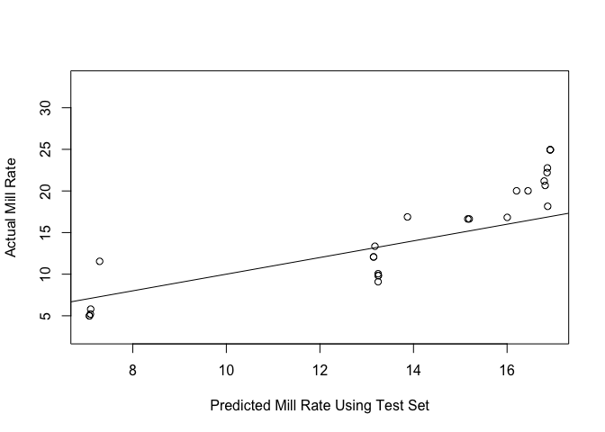
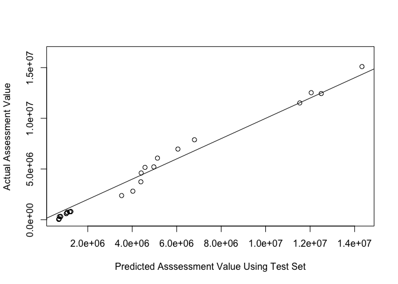

random forest and lme
================

``` r
suppressPackageStartupMessages(library(randomForest))
suppressPackageStartupMessages(library(tidyverse))
suppressPackageStartupMessages(library(lme4))
suppressPackageStartupMessages(library(ROCR))
suppressPackageStartupMessages(library(predictmeans))
```

``` r
dat <- readr::read_delim("test_train_data.txt", delim = ",", col_types = "ciccdddddc")
dat$municipality <- as.factor(dat$municipality)

factors_tbl = dat %>% 
  group_by(municipality) %>% 
  count(name="mun_count", sort = TRUE) %>% 
  ungroup() %>% 
  mutate(perc = mun_count/sum(mun_count),
         cum_perc = cumsum(perc)) %>% 
  arrange(desc(mun_count)) %>% 
  mutate(rank = row_number(),
         municipality = fct_reorder(municipality, rank)) %>% 
  mutate(col_municipality = fct_collapse(municipality, other = levels(municipality)[-c(1:52)])) %>% 
  select(municipality, col_municipality)

dat <- dat %>% 
  left_join(factors_tbl) %>% 
  select(-c(municipality)) %>% 
  rename(municipality = col_municipality) %>% 
  group_by(PIC) %>% 
  mutate(next.assess = lead(total.assessment, order_by = year),
         past.mill = lag(mill.rate, order_by = year)) %>%
  arrange(PIC) %>% 
  group_by(municipality, year) %>% 
  mutate(n.prop = n()) %>% 
  arrange(desc(n.prop)) %>% 
  distinct(municipality, .keep_all = T) 
```

    ## Joining, by = "municipality"

    ## Warning: Column `municipality` joining factors with different levels, coercing
    ## to character vector

``` r
train <- dat %>%  filter(test.train == "train") 
test <- dat %>%  filter(test.train == "test")
```

# Random Forest

``` r
set.seed(0)

rf.mill <- randomForest(
  mill.rate ~  tax.class + municipality + total.assessment + past.mill,na.action = na.omit, mtry = 4,
  data=train, ntree=500
)
#Evaluate variable importance
importance(rf.mill)
```

    ##                  IncNodePurity
    ## tax.class           3652.93960
    ## municipality        1514.35514
    ## total.assessment      27.34116
    ## past.mill            201.70582

``` r
varImpPlot(rf.mill)
```

<!-- -->

``` r
rf.as <- randomForest(
  next.assess ~  tax.class + municipality + total.assessment + mill.rate,na.action = na.omit,mtry = 4,
  data=train
)

importance(rf.as)
```

    ##                  IncNodePurity
    ## tax.class         1.511095e+12
    ## municipality      2.398779e+15
    ## total.assessment  5.623527e+15
    ## mill.rate         4.940560e+13

``` r
varImpPlot(rf.as)
```

<!-- -->

``` r
yhat.bag <- predict(rf.mill,newdata=test)
plot(yhat.bag, test$mill.rate, xlab="Predicted Mill Rate Using Test Set", ylab="Actual Mill Rate")
abline(0,1)
```

<!-- -->

``` r
yhat.bag1 <- predict(rf.as,newdata=test)
plot(yhat.bag1, test$next.assess, xlab="Predicted Asssessment Value Using Test Set", ylab="Actual Assessment Value")
abline(0,1)
```

<!-- -->

# Linear Mixed Effect Model

``` r
# both random slope and random intercept
# different rate of change of assessment value and mill rate as well as initial assessment value and mill rate for each municipality 

lme.mill <- lmer(mill.rate ~ 1+ (1+year|municipality) + as.factor(year) + tax.class  + total.assessment + past.mill, data = train)
```

    ## Warning: Some predictor variables are on very different scales: consider
    ## rescaling

    ## Warning in checkConv(attr(opt, "derivs"), opt$par, ctrl = control$checkConv, :
    ## unable to evaluate scaled gradient

    ## Warning in checkConv(attr(opt, "derivs"), opt$par, ctrl = control$checkConv, :
    ## Model failed to converge: degenerate Hessian with 1 negative eigenvalues

``` r
summary(lme.mill)
```

    ## Linear mixed model fit by REML ['lmerMod']
    ## Formula: mill.rate ~ 1 + (1 + year | municipality) + as.factor(year) +  
    ##     tax.class + total.assessment + past.mill
    ##    Data: train
    ## 
    ## REML criterion at convergence: 374.8
    ## 
    ## Scaled residuals: 
    ##     Min      1Q  Median      3Q     Max 
    ## -2.8092 -0.3353 -0.0221  0.3416  3.2199 
    ## 
    ## Random effects:
    ##  Groups       Name        Variance  Std.Dev. Corr
    ##  municipality (Intercept) 8.037e-01 0.896510     
    ##               year        7.902e-07 0.000889 0.94
    ##  Residual                 8.073e-01 0.898504     
    ## Number of obs: 95, groups:  municipality, 28
    ## 
    ## Fixed effects:
    ##                       Estimate Std. Error t value
    ## (Intercept)          3.272e+00  9.010e-01   3.632
    ## as.factor(year)2018 -3.648e-01  2.723e-01  -1.340
    ## as.factor(year)2019 -8.276e-01  2.868e-01  -2.885
    ## as.factor(year)2020 -6.053e-01  3.089e-01  -1.960
    ## tax.class06          1.209e+01  7.141e-01  16.934
    ## total.assessment    -5.570e-08  3.826e-08  -1.456
    ## past.mill            2.169e-01  4.232e-02   5.124
    ## 
    ## Correlation of Fixed Effects:
    ##             (Intr) a.()2018 a.()2019 a.()202 tx.c06 ttl.ss
    ## as.fc()2018 -0.175                                        
    ## as.fc()2019 -0.312  0.519                                 
    ## as.fc()2020 -0.398  0.491    0.590                        
    ## tax.class06 -0.113  0.011    0.015   -0.069               
    ## ttl.ssssmnt -0.342 -0.081   -0.164   -0.102  -0.162       
    ## past.mill   -0.623  0.048    0.233    0.400  -0.466  0.252
    ## fit warnings:
    ## Some predictor variables are on very different scales: consider rescaling
    ## convergence code: 0
    ## unable to evaluate scaled gradient
    ## Model failed to converge: degenerate  Hessian with 1 negative eigenvalues

``` r
lme.as <- lmer(next.assess ~ 1+ (1+year|municipality) + as.factor(year) + tax.class + total.assessment + mill.rate, data = train)
```

    ## Warning: Some predictor variables are on very different scales: consider
    ## rescaling

    ## Warning in checkConv(attr(opt, "derivs"), opt$par, ctrl = control$checkConv, :
    ## unable to evaluate scaled gradient

    ## Warning in checkConv(attr(opt, "derivs"), opt$par, ctrl = control$checkConv, :
    ## Model failed to converge: degenerate Hessian with 2 negative eigenvalues

``` r
summary(lme.as)
```

    ## Linear mixed model fit by REML ['lmerMod']
    ## Formula: next.assess ~ 1 + (1 + year | municipality) + as.factor(year) +  
    ##     tax.class + total.assessment + mill.rate
    ##    Data: train
    ## 
    ## REML criterion at convergence: 3028.7
    ## 
    ## Scaled residuals: 
    ##     Min      1Q  Median      3Q     Max 
    ## -2.2902 -0.2917 -0.0438  0.1291  3.6755 
    ## 
    ## Random effects:
    ##  Groups       Name        Variance  Std.Dev. Corr 
    ##  municipality (Intercept) 8.945e+11 945759        
    ##               year        3.669e+06   1915   -0.36
    ##  Residual                 7.163e+11 846329        
    ## Number of obs: 103, groups:  municipality, 28
    ## 
    ## Fixed effects:
    ##                       Estimate Std. Error t value
    ## (Intercept)          2.971e+06  9.755e+05   3.046
    ## as.factor(year)2017 -7.855e+04  2.647e+05  -0.297
    ## as.factor(year)2018  2.547e+04  2.733e+05   0.093
    ## as.factor(year)2019 -3.466e+05  2.988e+05  -1.160
    ## as.factor(year)2020 -7.408e+05  4.577e+05  -1.619
    ## tax.class06          1.115e+06  1.297e+06   0.860
    ## total.assessment     6.376e-01  4.119e-02  15.478
    ## mill.rate           -1.373e+05  8.217e+04  -1.671
    ## 
    ## Correlation of Fixed Effects:
    ##             (Intr) a.()2017 a.()2018 a.()2019 a.()202 tx.c06 ttl.ss
    ## as.fc()2017 -0.100                                                 
    ## as.fc()2018 -0.200  0.568                                          
    ## as.fc()2019 -0.286  0.537    0.608                                 
    ## as.fc()2020 -0.177  0.346    0.387    0.440                        
    ## tax.class06  0.394 -0.226   -0.349   -0.448   -0.247               
    ## ttl.ssssmnt -0.428 -0.072   -0.060   -0.088   -0.065  -0.314       
    ## mill.rate   -0.573  0.128    0.297    0.439    0.249  -0.915  0.391
    ## fit warnings:
    ## Some predictor variables are on very different scales: consider rescaling
    ## convergence code: 0
    ## unable to evaluate scaled gradient
    ## Model failed to converge: degenerate  Hessian with 2 negative eigenvalues

``` r
# check assumptions of lme

# Homogeneity of Variance
residplot(lme.mill)
residplot(lme.as)
```
